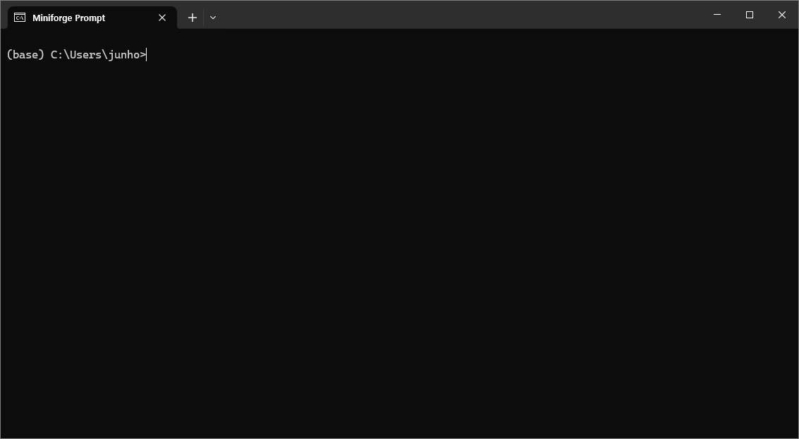

# Miniforge 설치하기

## conda란?

패키지와 환경설정 관리를 위한 커맨드라인 툴로써, 보통 파이썬 가상환경을 만들 때 활용하는 프로그램이다.

## conda 인스톨러

일반적으로 많이 쓰이는 conda 인스톨러는 아래 3가지이다.
- Anaconda Distribution
	- 아나콘다에서 제공하는 풀 패키지 인스톨러
	- Anaconda Navigator라는 GUI 패키지 관리자도 함께 제공
- Miniconda
	- 아나콘다에서 제공하는 최소 패키지 인스톨러
	- 원하는 패키지가 있다면 자신이 깔아서 쓰면 된다.
- Miniforge
	- conda-forge 커뮤니티에 의해 관리되는 패키지 인스톨러
	- 기본적으로 패키지를 conda-forge 채널에서 받도록 설정되어 있다.


## Miniforge 설치하기

이 문서는 오픈소스 커뮤니티에서 관리되는 conda 패키지 인스톨러인 Miniforge를 설치하는 것으로 기준으로 한다.

###### Miniforge3 설치하기

[Miniforge github](https://github.com/conda-forge/miniforge)를 방문해 운영체제에 맞는 [Miniforge3](https://github.com/conda-forge/miniforge?tab=readme-ov-file#miniforge3)를 설치하도록 하자.


### 가상환경 설정

###### Miniforge Prompt 구동

아래 그림과 같이 Miniforge Prompt를 띄워 conda 커맨드 라인 환경을 구동시킨다.




#### PyTorch를 위한 가상환경 만들기

이제 pytorch를 위한 conda 가상 환경 `pytorch`를 구축하는 경우를 생각해 보자.

가상환경을 만들기 위해서는 일반적으로 다음의 과정이 필요하다.
- `conda create -n` 새로운 환경을 만드는 커맨드
- `opencv-env` 와 같이 새로운 환경에 대한 이름
- `python=3.10`과 같이 파이썬 버젼을 지정

##### Conda 가상환경 만들기

Miniforge Prompt에서 다음과 같은 방식으로 `pytorch` 가상환경을 만들도록 한다.

```bash
conda create -n pytorch python=3.10
```

##### 가상환경 활성화

새롭게 만들어진 `pytorch` 환경을 활성화 하려면 다음과 같이  `activate` 명령을 활용한다.

```shell
conda activate pytorch
```

##### 가상환경 비활성화
현재 가상환경에서 빠져나오려면 다음과 같이 `deactivate` 명령을 사용한다.
```shell
conda deactivate
```


##### Conda 가상환경 리스트

일반적으로 여러 개의 가상환경을 쓰게 되는데, 어떤 가상환경이 있는지 다음과 같은 방식으로 가상환경 리스트를 뽑아볼 수 있다.

```shell
conda env list
```


#### 주요 Conda 명령

다음은 conda 가상환경에 관한 주요 명령을 모아놓았다. 보다 자세한 conda 명령은 [공식 문서](https://docs.conda.io/projects/conda/en/stable/commands/index.html)를 참고하도록 하자.

###### Conda 가상환경 활성화/비활성화
```shell
conda activate (가상환경이름)
conda deactivate
```

###### Conda 가상환경 이름 변경
```shell
conda rename -n (이전 환경이름) -d (새 환경이름)
```

###### Conda 가상환경 삭제
```shell
conda env remove -n (환경이름)
```

